# CSC3003_OIP_Object_Detection
 
## Installation
This project is using TensorFlow 2.5.0. Compatibility of the version can be found at [TensorFlow GPU Support](https://www.tensorflow.org/install/source#gpu)

- Visual Studio C++
- [CUDA](https://developer.nvidia.com/cuda-downloads)
- [cuDNN](https://developer.nvidia.com/cudnn)
- [Anacoda](https://docs.anaconda.com/anaconda/install/index.html)


## Gathering and Labeling Data
The image must be in [Pascal Voc](https://www.tensorflow.org/lite/api_docs/python/tflite_model_maker/object_detector/DataLoader#from_pascal_voc) format

The (labelImg)[https://github.com/tzutalin/labelImg] is a GUI that is able to generate the file for the images. It is fast to label and annotate the image.
It is able to support YOLO3, Pascal Voc etc,


### For Windows
Install the follwing using pip
- [PyQt5](https://www.riverbankcomputing.com/software/pyqt/download)
- [lxml](http://lxml.de/installation.html)

```
pyrcc4 -o libs/resources.py resources.qrc
For pyqt5, pyrcc5 -o libs/resources.py resources.qrc

```
Open the cmd and cd to the directory that the folder is saved. Run the following command to start the GUI

```
python labelImg.py
python labelImg.py [IMAGE_PATH] [PRE-DEFINED CLASS FILE]
```

### For Windows + Anaconda
Open the Anaconda Prompt and go to the labelImg directory

```
conda install pyqt=5
conda install -c anaconda lxml
pyrcc5 -o libs/resources.py resources.qrc
python labelImg.py
python labelImg.py [IMAGE_PATH] [PRE-DEFINED CLASS FILE]
```

[Watch the tutorial here](https://www.youtube.com/watch?v=p0nR2YsCY_U&ab_channel=TzuTaLin)
 
## TensorflowLite 2.5.0 Object Detection 
The project will focus on the following aspect:

1) Setting up of the environment
2) Running the TFLITE_Model_Maker.ipynb
3) Trainning the Data
4) Implementing on the Raspberry PI

Clone the project to a directory. It should only have the following folder and files
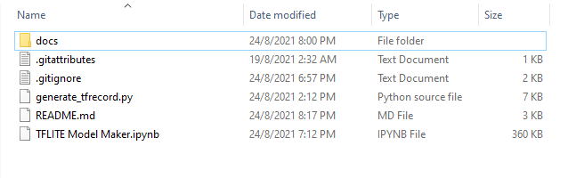

### Setting up of the environment
Before we start, we will be setting up our environment using anacoda.

Open the anacoda3 command prompt for windows and run it as an administrator

```conda create -n tensorflow pip python=3.8```

Activate the environment after creating it

```conda activate tensorflow```

Open the anacoda navigator and install Jupyter Notebook. Ensure that the environment you select is the environment that was created.

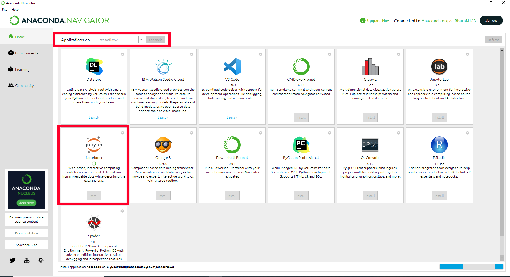

Once done, launch Jupyter Notebook and open the TFLITE_Model_Maker.ipynb from the directory

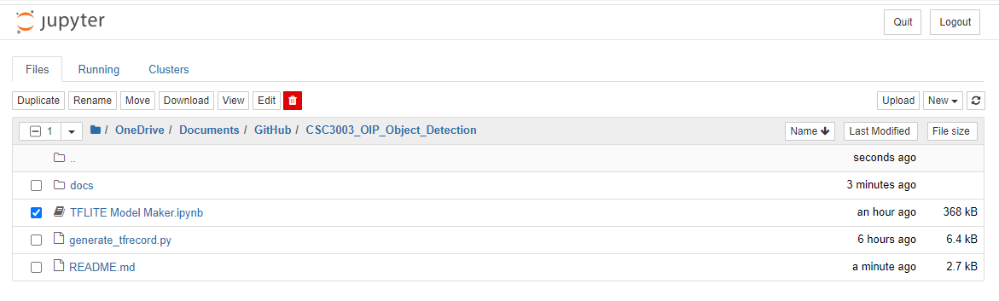

### Running the Running the TFLITE_Model_Maker.ipynb
#### 0. Setting up the environment

The steps will generate the empty folder for the preparation
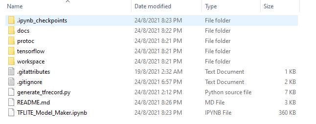
- tensorflow - Cloning of the tensorflow model gardern
- workspace - Training of the data

This project we will be using "ssd_mobilenet_v2_fpnlite_640x640_coco17_tpu-8". If you have other [TF Dectection Model Zoo]((https://github.com/tensorflow/models/blob/master/research/object_detection/g3doc/tf2_detection_zoo.md)) to install, replace the "PRETRAINED_MODEL_URL" and others accordingly
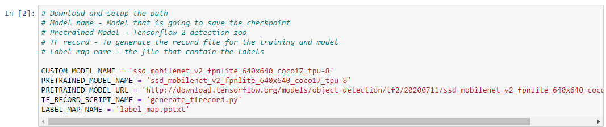

#### 1. Download TF Models Pretrained Models from Tensorflow Model Zoo
Restart the kernel and run again after this steps to reload the object detection. This will install the setup.py that was provided by tensorflow

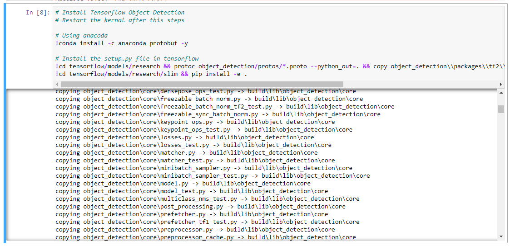

Ignore the following error as they require additional depedency to be install.


If everything have been installed correctly, the test will pass for the object detection

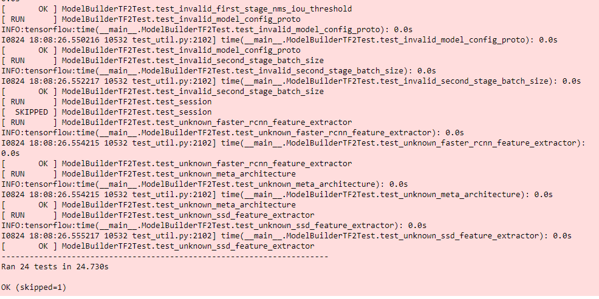

In the jupyter it might show you that tensorflow installed is 2.5.1. However, we will be using the tensorflow-gpu to train our model in the later stage. Ensure that tensorflow-gpu version is 2.5.0

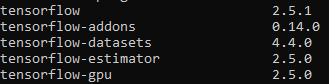

#### 2. Create Label Map
The label map is required when the detection is trying to identify the object.

Change the labels and id according to your own class. Id should be unqiue and incremental

**Example**

If 2 class,

```labels = [{'name':'dry syringe', 'id':1}, {'name':'dry plunger', 'id':2}]```

If 3 class,

```labels = [{'name':'dry syringe', 'id':1}, {'name':'dry plunger', 'id':2}, {'name':'wet syringe', 'id':3}]```

The pbtxt file will be created in the workspace/annotations folder as shown in the picture

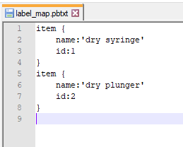

3. Create TF records

Before generating or running this steps, the images that was generated in the initial stage must be place under workspace/annotations. 2 folder should be name as train and test should be place inside the images folder. The recommended ratio to split the image would be 80% train and 20% test
Please include the xml file generated from labelImg inside the folder accordingly.

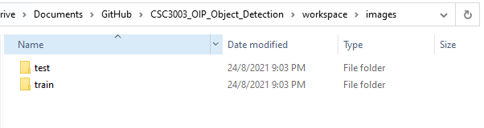

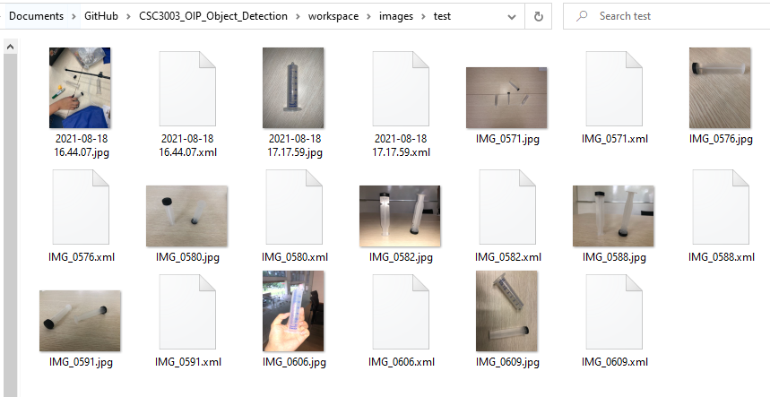

2 file train.record and test.record should be generated inside workspace/annotations

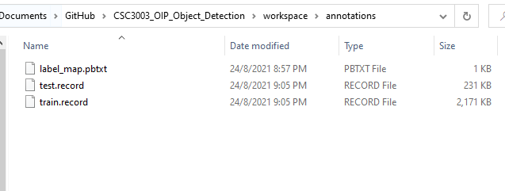

#### 4. Copy Model Config to Training Folder
After copying the model from the pretrained data, navigate to the workspace/models directory and configure the pipeline.config file.

Change the following
```
# Line 3 - num_classes - 2 (Depending on how many label you have)

# Line 135 - batch_size - 16 

# Line 165 - fine_tune_checkpoint - "workspace/pre-trained-models/ssd_mobilenet_v2_fpnlite_640x640_coco17_tpu-8/checkpoint/ckpt-0"

# Line 171 - fine_tune_checkpoint_type - "detection"

# For train_input_reader (Training)
# Line 175 - label_map_path - "workspace/annotations/label_map.pbtxt"
# Line 177 - input_path - "workspace/annotations/train.record" (File is generated from the generate_tfrecord.py)

# For eval_input_reader (testing)
# Line 185 - label_map_path - "workspace/annotations/label_map.pbtxt"
# Line 189 - input_path - "workspace/annotations/test.record" (File is generated from the generate_tfrecord.py)

````
# 5. Train the model
That is all for the data preperation and we will be proceeding to train our program. Remeber to have CUDA and cudNN installed and set in the environment path.

- C:\Program Files\NVIDIA GPU Computing Toolkit\CUDA\v11.2\bin
- C:\Program Files\NVIDIA GPU Computing Toolkit\CUDA\v11.2\libnvvp
- C:\Program Files\NVIDIA GPU Computing Toolkit\CUDA\v11.2\lib\x64

Copy the command line that is printed out in jupypter and paste it into the anacoda command prompt.
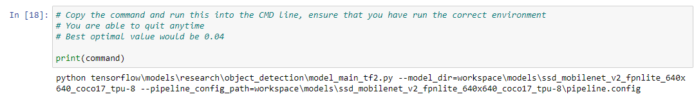

If cuda and cudnn is installed properly, it will shows that it have sucessfully open as shown in the image

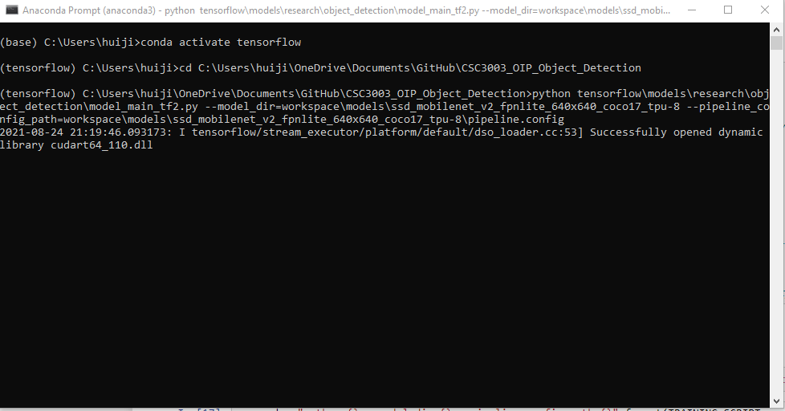

There might be an error indicating that the numpy does not match. Please run the following commands after the image


```
pip uninstall pycocotools
pip install pycocotools
```

It might take a while for the program to start training the dataset. Once it start training, it will show the losses and training time

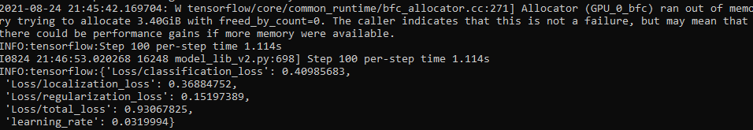

You can quit anytime you want as the checkpoint will be saved. The estimate optimal value to quit would be 0.03 and it is able to maintain at that range 

#### 6. Tensorflow Board (Optional)
To evaluate the graph, open another anacoda terminal as an administrator and cd to the project folder. The logdir should be pointing to your model name.

```
tensorboard --logdir=workspace\models\ssd_mobilenet_v2_fpnlite_640x640_coco17_tpu-8
```

Navigate to the link to view the tensorboard

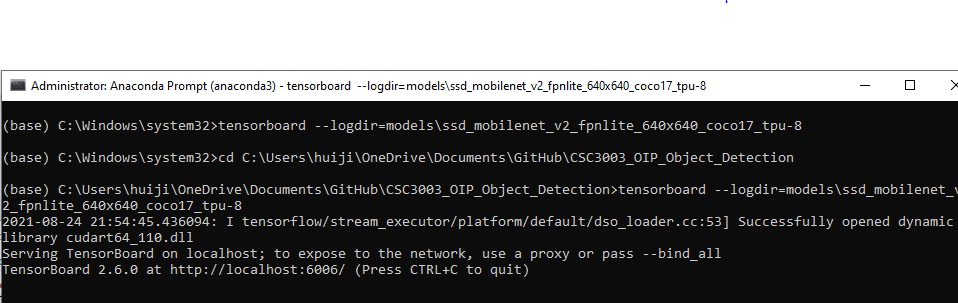

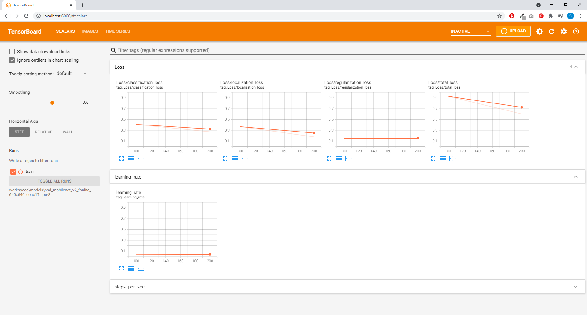

#### 7. Export to TFLite
Run through the command and the 2 file "detect.tflite" and "labelmap.txt" should be created be place inside the Raspberry PI for it to run


#### 8. Complie to EdgeTPU
Unfortunately, the compilation can only be ran in a linux platform. In this case, GoogleColab will be better as it does support the process. Upload "Coral_EdgeTPU_Compiler.ipynb" to GoogleColab and run the process accordingly.

Last updated : 24/8/2021