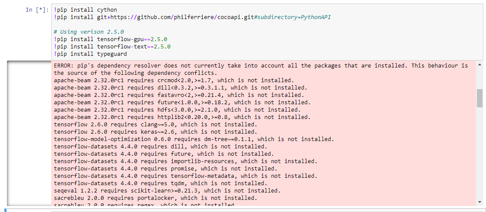

# CSC3003_OIP_Object_Detection
 
## Installation
This project is using TensorFlow 2.5.0. Compatibility of the version can be found at [TensorFlow GPU Support](https://www.tensorflow.org/install/source#gpu)

- Visual Studio C++
- [CUDA](https://developer.nvidia.com/cuda-downloads)
- [cuDNN](https://developer.nvidia.com/cudnn)
- [Anacoda](https://docs.anaconda.com/anaconda/install/index.html)


## Gathering and Labeling Data
The image must be in [Pascal Voc](https://www.tensorflow.org/lite/api_docs/python/tflite_model_maker/object_detector/DataLoader#from_pascal_voc) format

The (labelImg)[https://github.com/tzutalin/labelImg] is a GUI that is able to generate the file for the images. It is fast to label and annotate the image.
It is able to support YOLO3, Pascal Voc etc,


### For Windows
Install the follwing using pip
- [PyQt5](https://www.riverbankcomputing.com/software/pyqt/download)
- [lxml](http://lxml.de/installation.html)

```
pyrcc4 -o libs/resources.py resources.qrc
For pyqt5, pyrcc5 -o libs/resources.py resources.qrc

```
Open the cmd and cd to the directory that the folder is saved. Run the following command to start the GUI

```
python labelImg.py
python labelImg.py [IMAGE_PATH] [PRE-DEFINED CLASS FILE]
```

### For Windows + Anaconda
Open the Anaconda Prompt and go to the labelImg directory

```
conda install pyqt=5
conda install -c anaconda lxml
pyrcc5 -o libs/resources.py resources.qrc
python labelImg.py
python labelImg.py [IMAGE_PATH] [PRE-DEFINED CLASS FILE]
```

[Watch the tutorial here](https://www.youtube.com/watch?v=p0nR2YsCY_U&ab_channel=TzuTaLin)
 
## TensorflowLite 2.5.0 Object Detection 
The project will focus on the following aspect:

1) Setting up of the environment
2) Running the TFLITE_Model_Maker.ipynb
3) Trainning the Data
4) Implementing on the Raspberry PI

Clone the project to a directory. It should only have the following folder and files


### Setting up of the environment
Before we start, we will be setting up our environment using anacoda.

Open the anacoda3 command prompt for windows and run it as an administrator
```conda create -n tensorflow pip python=3.8```

Activate the environment after creating it
```conda activate tensorflow```

Open the anacoda navigator and install Jupyter Notebook. Ensure that the environment you select is the environment that was created.


Once done, launch Jupyter Notebook and open the TFLITE_Model_Maker.ipynb from the directory


### Running the Running the TFLITE_Model_Maker.ipynb
#### 0. Setting up the environment

The steps will generate the empty folder for the preparation

> tensorflow - Cloning of the tensorflow model gardern
> workspace - Training of the data

If you have other [TF Dectection Model Zoo]((https://github.com/tensorflow/models/blob/master/research/object_detection/g3doc/tf2_detection_zoo.md)) to install, replace the "PRETRAINED_MODEL_URL" and others accordingly


#### 1. Download TF Models Pretrained Models from Tensorflow Model Zoo
Restart the kernel and run again after this steps to reload the object detection. This will install the setup.py that was provided by tensorflow


Ignore the following error as they require additional depedency to be install.


If everything have been installed correctly, the test will pass for the object detection


In the jupyter it might show you that tensorflow installed is 2.5.1. However, we will be using the tensorflow-gpu to train our model in the later stage. Ensure that tensorflow-gpu version is 2.5.0


#### 2. Create Label Map
The label map is required when the detection is trying to identify the object.

Change the labels and id according to your own class. Id should be unqiue and incremental

**Example**
If 2 class,
```labels = [{'name':'dry syringe', 'id':1}, {'name':'dry plunger', 'id':2}]```

If 3 class,
```labels = [{'name':'dry syringe', 'id':1}, {'name':'dry plunger', 'id':2}, {'name':'wet syringe', 'id':3}]```

The pbtxt file will be created in the workspace/annotations folder


Last updated : 24/8/2021