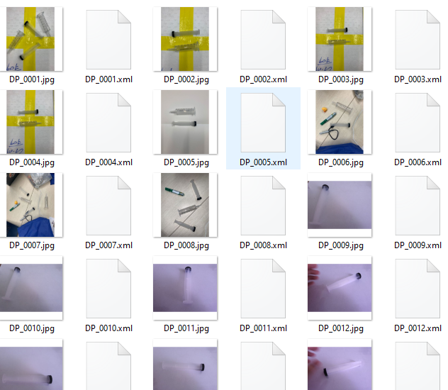
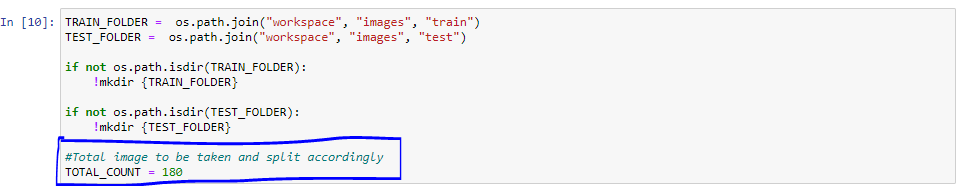
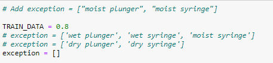

# CSC3003_OIP_Object_Detection

Last updated : 3/9/2021

# Ensure that you have installed the environment

## Open Jupyter notebook and navigate to Data_Preparation.ipynb

### 1. Navigate to workspace/images/dataset to compile the dataset

All the images and xml dataset should be here

### 2. Run as per normal You will be able to see a csv file being created under workspace/annotations/dataset_label.csv

### 3. You are able to specific the number of image you want to train under 4. Split Image

### 4. You are also able to choose the label you wish to exclude for the training and test data

### You are all set for to go!

### Other optional 
- Sort the image folder
- Rename the all the label in xml file
- Change the image name 
- Changing the image to grayscale
- Ostu thresholding

