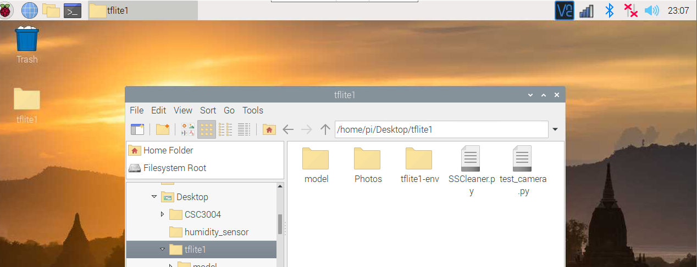

# CSC3003_OIP_Object_Detection

Last updated : 3/9/2021

## Equipment

- Raspberry Pi 3B+
- Raspberry Pi Camera

## Installation of Tflite
```
echo "deb https://packages.cloud.google.com/apt coral-edgetpu-stable main" | sudo tee /etc/apt/sources.list.d/coral-edgetpu.list
curl https://packages.cloud.google.com/apt/doc/apt-key.gpg | sudo apt-key add -
sudo apt-get update
sudo apt-get install python3-tflite-runtime
```

## Setting up of the virtual environment

1) Open Terminal / BASH
2) Create a folder for your project (mkdir folder_name)
3) Navigate to the project folder (cd folder_name)
4) Create the virtual environment (python3 -m venv ./venv)
5) Activate the virtual environment (source ./venv/bin/activate)

## Your folder should have the following
- SSCleaner.py
- test_camera.py (Optional to test the camera)
- model directory (Contain all the model and label)
- Photos (For the SSClean.py to load the image)



## Run the file (The sample model)
``` 
python3 SSCleaner.py --modeldir=model --grayscale --dev=ttyACM0
```

Options
-- modeldir (the path to all your model)
-- grayscale (enable grayscale image)
-- dev (serial port to the audrino) 
-- labels (path to a specific label filename) (model/label.txt)
-- graph (path to a specific model filename) (model/model.txt)

Can check by
```
ls -l  /dev/tty*
```

It should be ttyACM(?) where (?) is a digit